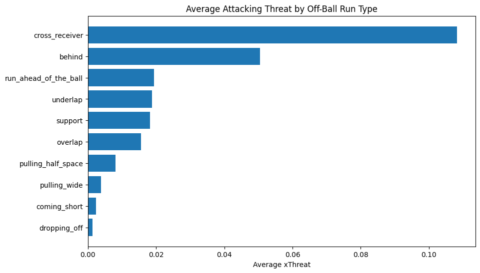

# Off-Ball Movement and Attacking Threat in Football

Understanding how off-ball movement contributes to attacking threat using tracking-derived data.

---

## Project Summary

In this project, I explored how off-ball movement contributes to attacking threat using tracking-derived data.

Rather than focusing only on what happens on the ball, the aim was to understand how players create value through movement, where they run, when they run, and how that affects attacking situations.

The results suggest that not all runs are equal. Some movements, especially those attacking the penalty area, tend to have a much higher impact on attacking outcomes.

---

## Highlights

- Around 5,000 off-ball runs analysed  
- Different run types identified and compared  
- xThreat used to estimate attacking value  
- Analysis across different phases of play  
- Player profiling using per 90 metrics  

---

**Tools:** Python, pandas, matplotlib, SkillCorner Open Data

---

## Overview

Most football analysis focuses on actions on the ball, such as passes or shots. However, many dangerous situations are created before that, through movement that disrupts defensive structure.

The aim here was to look at how players create value without touching the ball, by analysing where and when they move, and how those movements contribute to attacking threat.

The analysis is based on SkillCorner open data from A-League matches, using off-ball run events together with xThreat.

---

## Problem

Off-ball movement is a key part of attacking play, but it is difficult to measure and often overlooked.

This project tries to address that by linking different types of runs to attacking value, and understanding which movements are actually effective.

---

## Key Insights

- In this dataset, cross-receiver runs appear to be the most dangerous movement, generating around 0.108 xThreat per run, more than five times higher than support movements  

- Runs in behind are the most effective non-crossing movement, producing around 0.051 xThreat per run  

- Transition phases create the highest value, with cross-receiver runs during transitions reaching around 0.155 xThreat  

- There is a clear trade-off between frequency and attacking impact, with high-volume movements contributing less directly to attacking threat  

- Attacking players, especially centre forwards and wide players, generate most of the threat through repeated high-value runs  

Overall, the value of a run depends less on how often it happens, and more on when, where, and how it is made.

---

## Example Visuals

## Run Value by Type

The chart below shows the average attacking threat generated per run type.

Cross-receiver runs stand out as the most dangerous movement in this dataset. In contrast, support and build-up runs occur more frequently but are less directly linked to high-value attacking situations.

---

These spatial patterns help explain where runs start and where they create value.

### Run Starting Locations  

Most runs start in organised attacking areas just beyond the halfway line, where teams are in controlled possession and looking to progress the ball.

---

### Run Ending Locations  

Runs tend to finish in central final-third zones, close to goal. This shows how movement helps turn possession into genuinely dangerous situations.

---

## Approach

The workflow for the project was kept simple and focused:

- Classify off-ball runs into different types  
- Assign attacking value using xThreat  
- Compare how often each run type occurs and how effective it is  
- Analyse differences across phases of play  
- Build player profiles using per 90 metrics  
- Study spatial patterns of movement  
- Use a simple model to support the analysis  

---

## xThreat Attribution

xThreat was used as a way to estimate the attacking value created by each run.

Each off-ball run was linked to the next on-ball action in the sequence, such as a pass or carry, and the xThreat value of that action was assigned to the run.

This is not a perfect measure, but it provides a practical way to connect movement with how the ball progresses into more dangerous areas.

---

## Spatial Insight

A clear pattern comes out of the data.

Runs usually start in structured attacking areas and end closer to goal, in more dangerous central zones. This reflects how teams use movement to progress the ball into better attacking positions.

---

## Modelling Run Value

A simple linear regression model was used to explore which factors influence the value of an off-ball run.

The model included variables such as run type, phase of play, and spatial context.

Results showed that run type and phase of play consistently explain a meaningful part of the variation in attacking value, with movements in transition phases and runs attacking the penalty area standing out.

The model was used mainly to support and confirm the patterns observed in the analysis, rather than as a predictive tool.

---

## Results Summary

Off-ball movement contributes to attacking threat in different ways depending on the situation.

Runs that attack the penalty area are the most directly dangerous, especially during transitions. In contrast, support runs are more frequent but less likely to lead to immediate threat.

From a spatial point of view, movement helps progress the ball from organised areas into more dangerous zones.

Overall, effectiveness comes down to timing, location, and intent rather than volume.

---

## Player Insight

A. Goodwin stands out in the dataset, producing around 3.20 xThreat per 90.

This shows that players can generate high attacking output through efficient movement, not just by making a large number of runs.

---

## Project Structure

- [01_data_preparation.ipynb](01_data_preparation.ipynb) loads and prepares the data  
- [02_off_ball_movement_analysis.ipynb](02_off_ball_movement_analysis.ipynb) contains the main analysis and modelling  

---

## Data

- SkillCorner Open Data (tracking-derived events)  
- A-League matches  
- Around 5,000 off-ball runs analysed  
- xThreat used as the main measure of value  

---

## Practical Applications

This type of analysis can support decision-making in several ways.

For recruitment, it helps identify players who contribute through movement, not just actions on the ball.

For tactical analysis, it highlights which types of runs are most effective in different situations.

It can also support player development by identifying whether a player relies more on volume or on high-impact movements.

---

## Limitations

- Does not include full defensive context such as pressure or positioning  
- xThreat does not capture all aspects of attacking play  
- Run classifications simplify complex behaviours  
- The dataset is limited to A-League matches, so findings should be interpreted within that context  

---

## Why This Matters

Off-ball movement is a key part of attacking play, but it is often overlooked.

By combining movement, space, and context, this project provides a clearer view of how players contribute without touching the ball.

---

## Final Takeaway

Not all movement is equal. The most effective players are those who combine timing, space, and intent to create real attacking value.

---

## Author

Yiannis  
MSc Football Data Analytics
