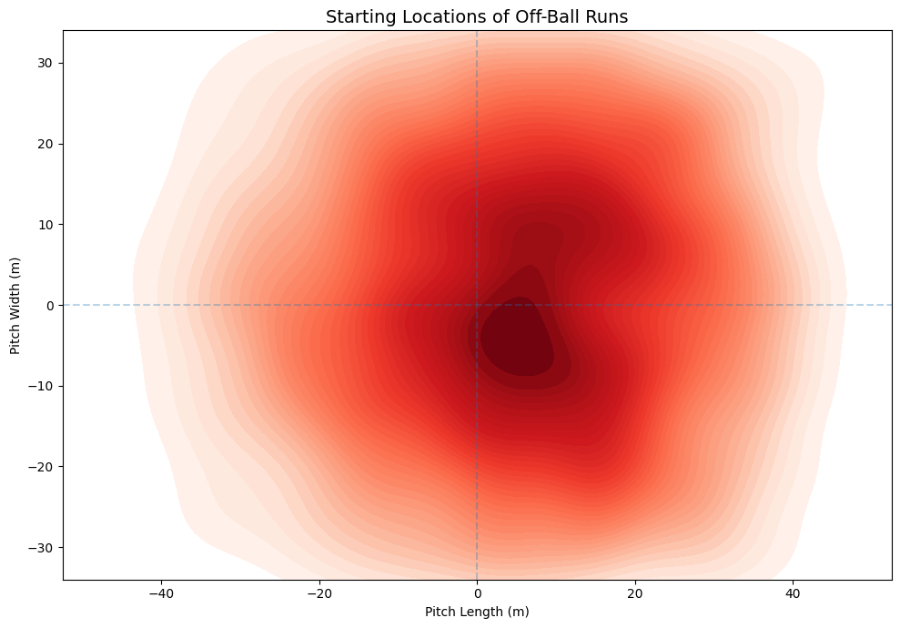
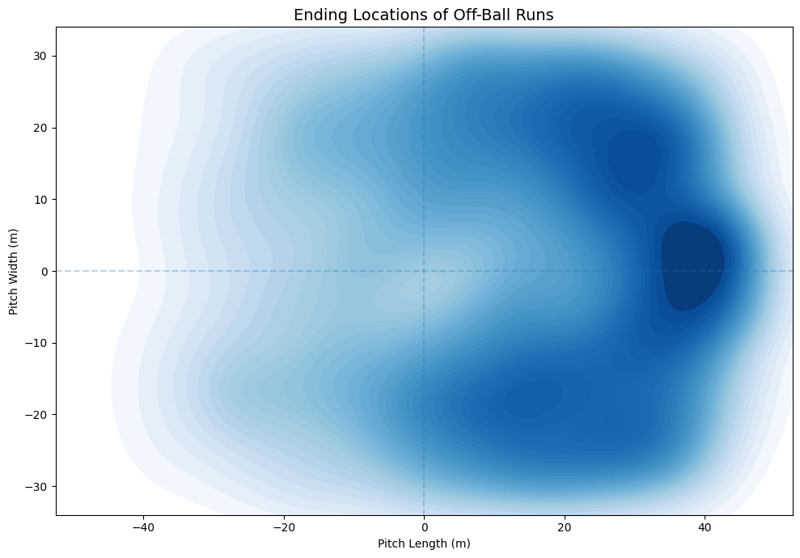

#  Off-Ball Movement and Attacking Threat

Understanding how off-ball movement creates attacking threat using tracking-derived data.

---

##  Overview

This project explores how off-ball runs contribute to attacking threat in football.

Rather than focusing only on actions on the ball, the aim is to understand how players create value through movement — where they run, when they run, and how those runs influence attacking situations.

The analysis is based on SkillCorner open data (A-League sample), using off-ball run events and xThreat as a measure of attacking value.

---

##  Key Insights

- Cross-receiver runs are by far the most dangerous, generating **~0.108 xThreat per run**, over **5× higher than support movements (~0.018)**  
- Runs in behind are the most valuable non-crossing movement, producing **~0.051 xThreat**, more than **2.5× the value of support or overlap runs**  
- Transition moments create the highest value, with transition cross-receiver runs reaching **~0.155 xThreat per run**  
- A clear trade-off exists between frequency and effectiveness — high-volume movements contribute less directly to attacking threat  
- Off-ball movement consistently progresses play into central, high-value areas in the final third  

---

##  Example Visuals

## 📊 Example Visuals

### Run Value by Type

### Run Starting Locations

### Run Ending Locations

---

##  Approach

The project follows a simple, structured workflow:

- Classify off-ball runs into different movement types  
- Measure their attacking value using xThreat  
- Compare frequency vs effectiveness  
- Analyse runs across different phases of play  
- Build player-level profiles (per 90 metrics)  
- Study spatial patterns (start and end locations)  
- Use a simple regression model to understand what drives run value  

---

##  Spatial Insight

A clear movement pattern emerges:

- Runs typically start in structured attacking areas  
  (~0 to 20 metres inside the attacking half)

- Runs most often end in high-value central zones  
  (~30 to 50 metres, directly in front of goal)

This highlights how off-ball movement progresses attacks from stable possession into dangerous scoring areas.

---

##  Modelling Run Value

A regression model was used to understand what makes a run dangerous.

Key findings:

- Cross-receiver runs are the most effective in generating threat  
- Runs during transitions and quick breaks are significantly more dangerous  
- The value of a run depends on both the type of movement and the game context  

---

##  Results Summary

The analysis shows that off-ball movement creates value in different ways.

Box-attacking runs are the most directly dangerous, especially when they occur in fast attacking phases such as transitions and quick breaks. In contrast, support movements happen more often but are less directly linked to immediate attacking threat.

From a spatial perspective, runs tend to begin in organised attacking positions and finish in more dangerous areas closer to goal. This highlights how movement helps progress attacks into high-value zones.

Overall, the effectiveness of a run is not just about how often it happens, but about where it happens and when it happens.

---

##  Player Insight

- **A. Goodwin** records one of the highest attacking outputs:
  - **3.20 xThreat per 90**
  - Demonstrates how efficient off-ball movement can outperform sheer volume of runs  

This highlights the importance of evaluating players not just by how often they move, but by the impact of those movements.

---

##  Project Structure

- `01_data_preparation.ipynb` → loads the SkillCorner open data, extracts off-ball run events, and prepares the dataset  
- `02_off_ball_movement_analysis.ipynb` → run-type analysis, player profiling, spatial analysis, and regression modelling  

---

##  Data

- SkillCorner Open Data (tracking-derived event dataset)  
- Competition: A-League (sample matches)  
- Off-ball run events (~5,000+)  
- xThreat values  

---

##  Practical Applications

This type of analysis can support decision-making in several ways.

From a recruitment perspective, it can help identify players who generate attacking threat through movement, not just through actions on the ball. This is particularly useful for profiling forwards and wide players who contribute through positioning and timing of runs.

From a tactical perspective, it can highlight which types of runs are most effective in different phases of play. For example, teams may benefit from encouraging more box-attacking movements during transition phases, where space is greater.

It can also support player development by identifying whether a player relies more on volume of runs or on high-impact movements, helping coaches tailor training and decision-making.

Overall, this approach provides a more complete understanding of attacking contribution beyond traditional metrics.

---

##  Limitations

- Does not include full defensive context (e.g. pressure, positioning)  
- xThreat captures attacking value but not all tactical impact  
- Run classifications simplify complex in-game movements  
- Analysis focuses on general patterns rather than team-specific tactics  

---

##  Why This Matters

Off-ball movement is a key part of attacking play, but it is often overlooked.

This project shows that combining movement, space, and context can provide deeper insight into how teams create chances, and how players contribute beyond actions on the ball.

---

##  Author

Yiannis — MSc Football Data Analytics
